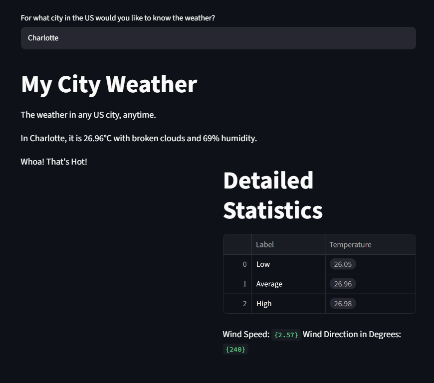

# week5-lesson2-challenge
A simple app that allows the user to input any US city and display relevant weather data via streamlit

### Prerequisites
- Python 3.10+
- Git

### Installation
```bash
#Clone the Repo
GitHub repo: "week5-lesson2-challenge"
git clone https://github.com/calebbmcneill/week5-lesson2-challenge
cd week5-lesson2-challenge

#Create and activate a virtual environment
python3 -m venv .venv
.venv/Scripts/activate.ps1

#Install Dependencies
pip install -r requirements.txt
Running the App

### Usage
streamlit run weatherreport.py
Then: open browser at localhost:8502

### Documentation
.env #OPEN WEATHER API Key
.gitignore # .env (Secure keys)

### Streamlit Output example (readme_demo.jpg)
